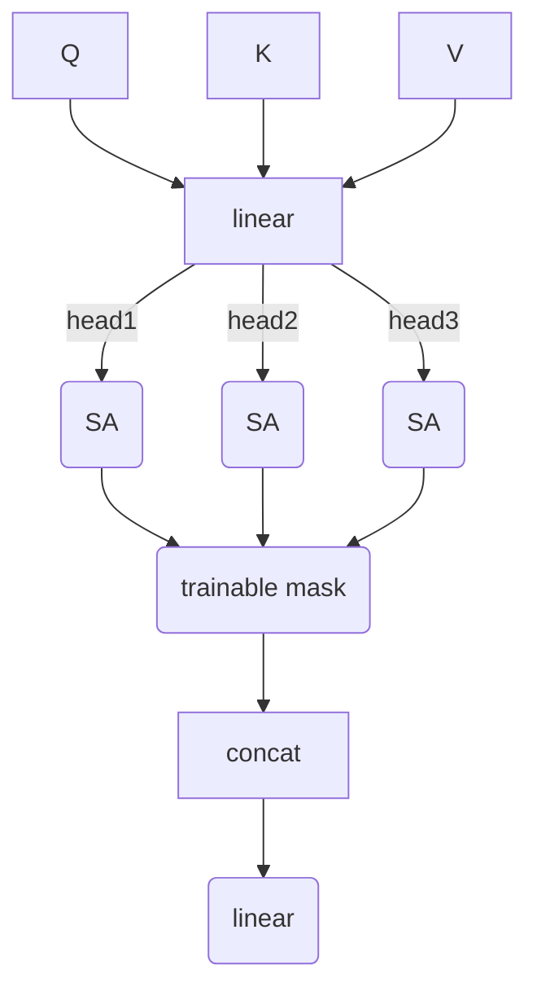
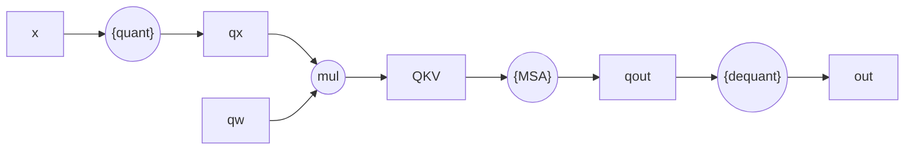

# ch3

## Transformer剪枝与量化方法

> TODO
>
> - [ ] 加入attention头部权重分布分析，主要针对前后的linear

本章首先对Transformer结构中每个组件的大小，计算量进行了分析，同时总结了现有研究中的的剪枝与量化方法，之后对现有的剪枝与量化方法进行改进并将其运用于Transformer网络结构模型。

### 问题提出

以Transformer为基础的网络结构在自然语言处理，计算机视觉等领域都提供了SOTA级别的预测性能，但其庞大的计算量、参数量使得将这些网络模型部署在如边缘设备都资源受限的硬件环境下成为挑战。为了解决该问题，模型压缩是被学术界和工业界广泛采用的手段。模型压缩通过减少模型体积、运算量等方法，牺牲部分网络模型性能换取更小的网络体积和网络推理时资源消耗。在模型压缩方法中，剪枝(prune)和量化(quantization)是最常见、适用面较广，且被诸多研究[^cite]证实有效的方法。在基于卷积操作的神经网络中，通过结合剪枝和量化方法可以在以微小的性能为代价的情况下实现巨大的压缩比例。本章将对如何运用剪枝和量化压缩方法到基于自注意力网络模型中，保留性能同时减少模型的计算量、参数量的问题展开研究讨论。

自注意力机制(SA)和多头注意力机制(MSA)是以Transformer为基础的网络结构的标识，也是Transformer网络模型性能强大的主要原因，但其也在网络推理过程中消耗了主要的资源。下图是基于Transformer结构，在自然语言处理领域中有重要影响力的网络模型Bert，其网络模型大小，计算量，运行时内存以及时延等在网络各个结构之间的占比。MSA层（MSA以及其前后的线性层）和全连接层组成了网络的主要参数量和运算量(>95%)，故下文将对这些层为主要目标进行压缩以达到减少网络整体参数量和运算量的目的。

剪枝方法可以主要分为两大类别：非结构化剪枝与结构化剪枝。非结构化剪枝通过将权重中不重要的值置零，将权重转换为稀疏矩阵，之后通过如哈夫曼编码等压缩方法减少权重的整体体积。非结构化剪枝仅考虑对权重中的值进行移除与神经网络结构无关，故可以适用于任意网络结构，其可以减少网络模型的体积大小，但是在没有特定的软硬件优化的情况下，非结构化剪枝对网络模型推理时的时延、内存占用、计算量等几乎没有帮助。结构化剪枝则通过剪除网络结构中不重要的连接来实现对网络的压缩，结构化剪枝的方法需要考虑网络的结构特点，针对不同的结构制定不同的剪枝方案，但由于其真实剪除了网络结构中的连接，故在没有特定软硬件支持情况下就可以实现网络推理时的资源消耗减少。

量化通过降低神经网络权重精度来到达减少网络模型体积，加速网络推理的目的。目前未经过量化的神经网络权重通常使用32位浮点数(float32)存储，对比量化中通常使用的8位整形(int8)精度，量化后的网络模型通常可以减少4x的网络模型体积，减少2-4x的内存占用以及因为减少内存读取和使用int8计算带来的加速而带来的2-4x的推理速度提升。然而和其他模型压缩方法一样，量化会牺牲一定的网络模型性能，该部分性能损失可以通过量化感知训练(QAT, Quantization Aware Training)来弥补。QAT在神经网络训练过程中的前向和反向传播时插入伪量化模块，通过QAT的网络模型可以更好适应量化误差，进而减少量化带来的性能损失。

剪枝操作和量化操作可以分别作用于网络结构模型，虽然在实践过程中通常对网络模型先进行剪枝操作，之后进行量化操作，两种压缩方法可以独立对网络进行互不影响，故在本章中将剪枝和量化方法分开单独讨论，在第四章中将结合剪枝和量化方法用于网络压缩。

### 剪枝方法

在非结构化剪枝中，最常使用的方法是大小剪枝(MP, Magnitude Pruning)。给定网络模型$\textbf{M}$以及权重$w$，给定剪枝目标稀疏度$s$，MP直接通过权重$w$中值的大小判断权重的重要性，其统计权重的值后根据$s$计算得到阈值$\mathscr{t}$，将权重张量中所有小于$\mathscr{t}$的值归零得到剪枝后的权重$w'$，归零操作通过给$w$乘以遮蔽(mask)矩阵$m$实现，见下式。
$$
w' = m \odot w \\ \text{where}  \ m_i = 0 \ \text{if} \ w_i < \mathscr{t} \ \text{else} \ 1
$$
在进行MP剪枝过程中，为了使权重的值稀疏化利于进行剪枝操作，通常会在网络模型在训练过程中在训练目标中加入正则项(regularization)，使训练过程中降低网络模型的损失同时，降低网络模型权重的范数，其训练目标如下。其中$x,y$分别表示训练数据集$\mathcal{D}$中的数据和对应的标签，$\lambda$为稀疏化训练的超参数，$i\in\{0,1\}$表示0范数或1范数。
$$
\min _w  \sum_\mathcal{D}\text{loss} (\textbf{M}(x;w), y) + \lambda ||w||_{i}
$$
MP方法优点是简单易行，可以直接对网络模型进行后训练剪枝，无需在训练时或剪枝后采取额外的步骤，采取mask的方法也能很好控制权重之间的连接。MP的缺点有：(1)MP中使用权重本身大小来判断连接的重要程度，在训练过程中网络本身的损失和网络整体的稀疏程度（正则项）使用的也是同一权重，这可能会对网络训练时的优化造成阻碍，同时只能适用于非结构化剪枝，拓展性较差。(2)MP是非结构化剪枝方法，对网络进行MP剪枝后如无特殊的软硬件支持，只能减少网络的体积，对网络在推理时的资源消耗没有帮助。

#### 可训练的Mask剪枝

> TODO
>
> - [ ] 根据实验改进

为了解决上述问题，本文提出可训练的Mask剪枝方法(TMP, Trainable Mask Pruning)。和MP的不同，TMP将mask作为参数和网络模型本身解耦，在训练过程中由网络模型权重负责控制网络的性能，由对mask的正则化负责网络稀疏程度的控制。网络在训练过程中的优化目标如下，训练完成后通过mask中本身的值（而非权重中的值）判断网络模型中连接的重要性，给定$s$首先对$m$中的值进行排序得到剪枝阈值$\mathscr{t} = P_s$，$P_s$表示百分位为$s$的数值，最后将$m$中小于阈值的数值归零，其余值保持不变，即$m_i = 0 \ \text{if} \ m_i < \mathscr{t} \ \text{else} \ m_i$。
$$
\min _{w,m}  \sum_\mathcal{D}\text{loss} (\textbf{M}(x;w\odot m), y) + \lambda ||m||_{i}
$$
将mask作为参数独立训练的好处有：(1)网络模型能够在训练过程中学习到连接间的重要性，能更好适应不同的网络模型结构。(2)将控制稀疏性参数和网络模型本身权重参数独立，能更准确控制网络稀疏度同时使方法的适用面更广，由于其不再依赖网络模型的权重来提供连接重要性判断依据，因而可以不仅限于非结构化剪枝。

#### MSA剪枝

MSA层占据了Transformer网络模型的大部分计算量与参数量，许多研究都质疑过其重要性。事实上有文献证实，采用更少的头部数量而不降低网络模型的预测性能是切实可行的。本文通过将上节中提出的TMP剪枝方法运用于对MSA的层的头部数量剪枝，以MSA的单个头部为最小单位，在训练过程中通过学习的方式，获取每个头部的重要性。通过该结构化剪枝可以实现在通用的软硬件平台上网络整体的参数量、计算量降低。

具体剪枝过程如图所示：多头注意力层的原始计算过程见等式和图，本文在将每个头部注意力拼接前加如可训练的mask矩阵$m$，经过mask后的多头注意力机制(MMSA, Masked MSA)计算过程可以表示为下式。其中$m$的长度为$h$，$h$表示原始的头部数量。训练过程中采用上式的优化方法，对网络权重以及mask进行优化。训练完成后，根据剪枝率$s$计算得到剪枝阈值$\mathscr{t}$，对于$m$中值小于$\mathscr{t}$的元素，则将网络模型中对应的头部减去，剪枝完成后将$m$中元素和$W^O$融合，并移除$m$。
$$
\textbf{MMSA}(Q,K,V)=\text{Concat}((head_1,...,head_h)\odot m)W^O
$$
通过算法[^ref]可知在MSA主流实现中会使用矩阵的转置、变形等操作来实现多个自注意力间拼接。为此本文也提出上述剪枝方法的矩阵操作实现方法，即通过将$m$设置为对角矩阵，之后通过矩阵乘法替换元素相乘实现mask的和头部向量间的元素相乘。设每个SA的输出向量维度为$d$，MSA层中共有$h$个SA头部，则在拼接前的向量$H=(head_1,...,head_h)$维度为$(d,h)$，设定剪枝矩阵为维度为$(h,h)$的对角矩阵$\text{Mask} = \text{diag}_h(m_i)$，在拼接前通过将$H$和$m$进行向量相乘得到剪枝后的$H$值，然后进行后续步骤计算。在剪枝完成后，$m$和$W^O$的融合操作也可以通过将$\text{Mask}$进行转置变形后和$W^O$进行矩阵乘法实现。
$$
\textbf{MMSA}(Q,K,V)=\text{Transpose\&Reshape}(H \times \text{Mask}) \times W^O \\ where \ H=(head_1,...,head_h) \\
$$
> TODO
>
> - [ ] 可加入修改后剪枝过程描述

剪枝之后若网络模型损失超过预期可以通过在训练集$D$上微调(finetune)来恢复精度，在微调恢复精度过程中，优化目标和上式一致，但是需要去掉用于稀疏化参数的正则项。

### 量化方法

> - 线性量化方法
>   - [ ] ~~对称、非对称~~
>   - [x] channel-wise，tensor-wise
>   - [x] s, z计算
>   - [x] STE
> - MSA量化流程

神经网络量化通过将使用32位浮点数存储的网络模型权重和激活（计算中间结果）转换为8位或更低精度的数据类型（通常为8位整形数字）。部分研究提出使用如Kmeans[^cite]，或log2量化方法实现了较高的压缩率，然而这些想要充分发挥这些方法的效果，需要特定的软件、硬件层面上的支持，故在本文中量化方法的研究对象为线性量化(Uniform Quanization)，线性量化适用于大多数硬件设备，且被主流的深度学习软件库支持[^cite]。

#### 线性量化

在小节[^ref]中对线性量化中的非对称线性量化的计算过程进行了介绍，在量化和反量化过程中，线性量化的量化算子具有两个参数：零点偏移量$z$和缩放因子$s$，二者通过张量的上界$u$和下界$l$确定，通常使用张量中的最大值和最小值（MinMax方法）。给定量化对象张量$w$及量化精度$b$，其计算过程如下式[^ref]：
$$
l =\min(w), u=\max(w),\\
s= \frac {2^b-1} {u-l},zp=\text{clamp}(\text{round}(-l\times s), 0, 2^b-1)
$$
> - [x] 介绍STE

网络模型权重中的最大值与最小值可以直接获取，若要对网络的张量进行量化，则需要通过使用一个测试数据集（通常从训练集中随机采样得到），抑或是在训练过程中进行观测，对网络模型激活的分布进行校准。在文献[^cite]中提出使用指数平均数(EMA, Exponential Moving Average)的方式替代简单的MinMax方法，在训练过程中确定激活的$l$和$u$。由于量化算子中有截取操作，其具有不可微的属性，若想要对网络模型进行QAT则需要使用特殊方法对伪量化后模型的前向传播和反向传播过程进行处理。目前最常用的方法在训练过程反向传播中中使用STE[^cite]，伪量化后操作的反向传播时的梯度计算方法如式[^ref]。
$$
\frac {\partial y} {\partial x} = \left \{
	\begin{array}{**lr**}
	\frac {\partial y} {\partial x^Q}, &\text{if} \ l < x <u  \\
	0, &\text{else}
	\end{array}
\right.
$$

#### MSA层按头部量化

在基础版的线性量化中，每个张量$T$中所有元素共享一组量化参数$zp$和$s$，由于其为张量为单位又称为按张量量化(tensor-wise quantization)。在以卷积操作为基础的网络结构中，每个卷积核间的权重分布差异较大且重要性不一，为了在较低精度量化后提升网络的性能，文献[^cite]通过给与每个卷积核单独的量化参数$zp$和$s$来提升量化后网络的性能，该量化方法成为称卷积核量化(kernel-wise quantization)。在上节[^cite]中的描述中可知，在MSA层中的每个头部对网络模型整体性能的重要性不同，本文以此为依据提出按头部量化(head-wise quantization)，对于MSA层中每个头部采用单独的$zp$和$s$参数，如图[^ref]。

> - [ ] ~~参考kernel-wise的描述：[IEEE Xplore Full-Text PDF:](https://ieeexplore.ieee.org/stamp/stamp.jsp?tp=&arnumber=9022167)~~
> - [ ] kernel-wise示意图
> - [ ] head-wise quant的LFG拆解
> - [x] 为什么不采用更细粒度的量化方式？硬件兼容性

Head-wise量化对MSA层中每个头部分布不同选取不同的量化参数可以很好的描述各个头部参数的分布特点同时不引入过多的参数量。给定MSA层，其头部数量为$h$，输入维度为$D$，每个头部维度为$d$，则该MSA的输入和输出的线性层参数量为$(h,D\times d)$，采用Head-wise量化需要存储的量化参数为每个头部的$s$和$zp$，参数量为$O(h)$。若采用更细粒度的量化方式，如对于输入每个的维度进行量化，则输入和输出的线性层的后需要的参数量为$O(D)$或$O(h\times D)$。在常见的网络结构中，具有$h<<D$的特点，在vit-base[^cite]的参数设置中$h=16,D=768$，二者对量化参数量带来差距巨大，故本文认为采用Head-wise的量化粒度从参数量和对硬件友好程度来说为合适的选择。

算法[^ref]和图[^ref]中描述了MSA层实现中的计算过程和对应的LFG图，在MSA层中插入量化模块后其计算过程如算法[^ref]。考虑到目前部分深度学习软件库不支持量化矩阵间的乘法，对于这种情况在算法中的通过插入额外的量化与反量化模块，将$Q,K,V$反量化为浮点数进行SA计算后的结果再量化为整形进行后续线性层计算的方式实现。

> - [x] 算法描述 quantized MSA

将算法[^ef]描述的计算过程转换得到量化后的MSA层内计算图LFG，见图[^ref]。图中的quant/dequant/msa分别表示量化和反量化模块以及多头注意力机制计算，其实际表示一个子图，其内容见图[^ref]，为了简洁起见在图中使用一个节点表示。

> - [x] LFG 4 quantized MSA

### 本章小结

本章首先对Transformer结构模型的推理时每种层结构的资源消耗占比进行了分析，同时分析了其中消耗资源较多的MSA层内每个头部的重要性和分布特点。之后本文对模型压缩中的剪枝和量化方法进行了简单的介绍，接着分别根据上述分析内容对现有的剪枝和量化方法提出了对应的该进方法。