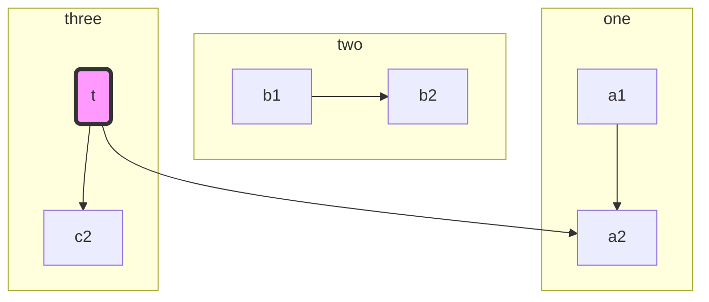
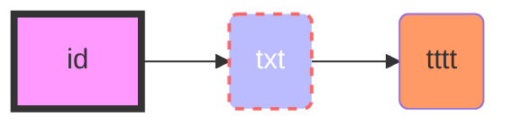
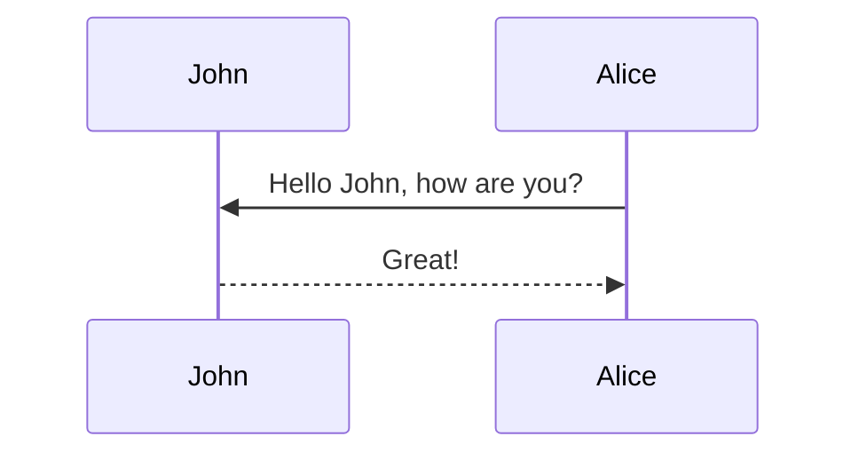
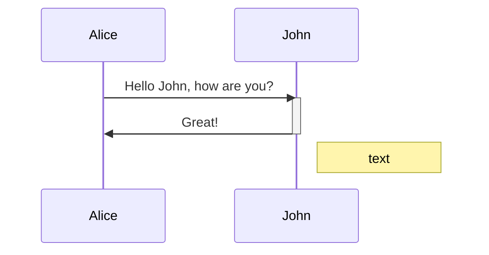
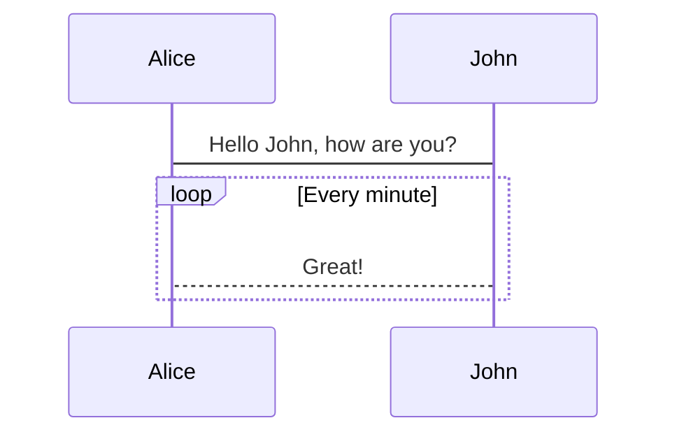
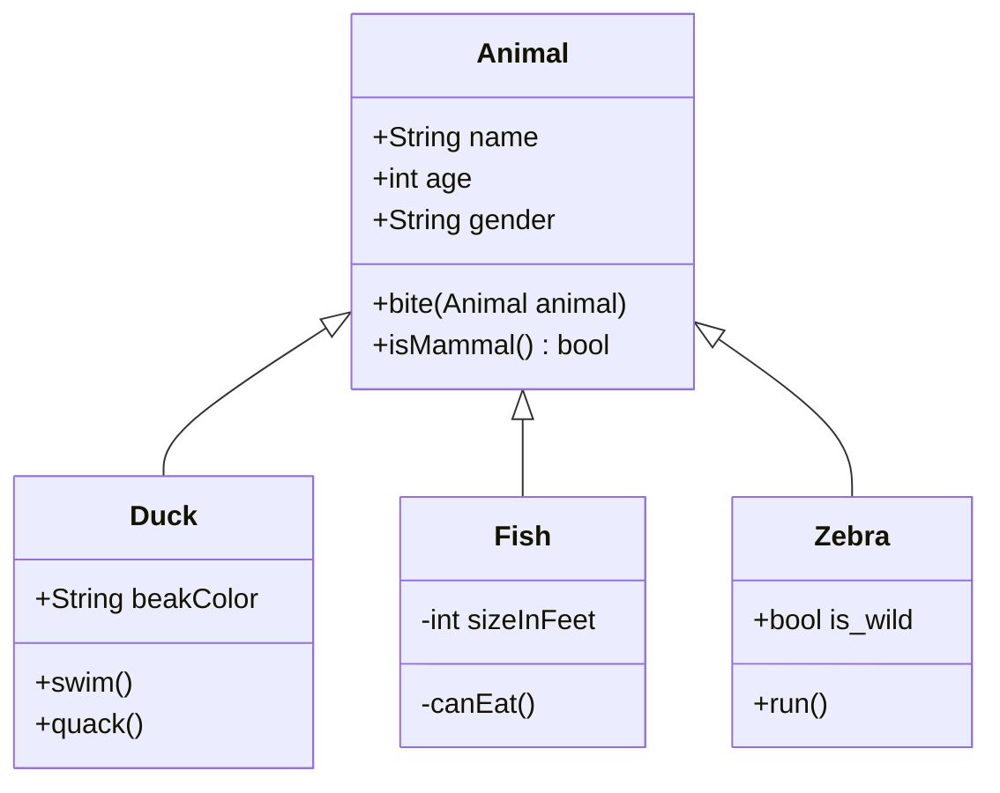
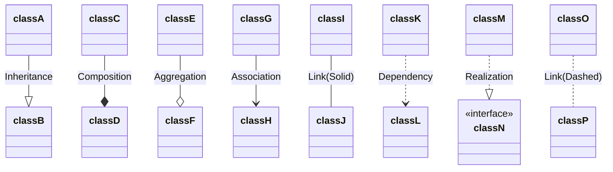
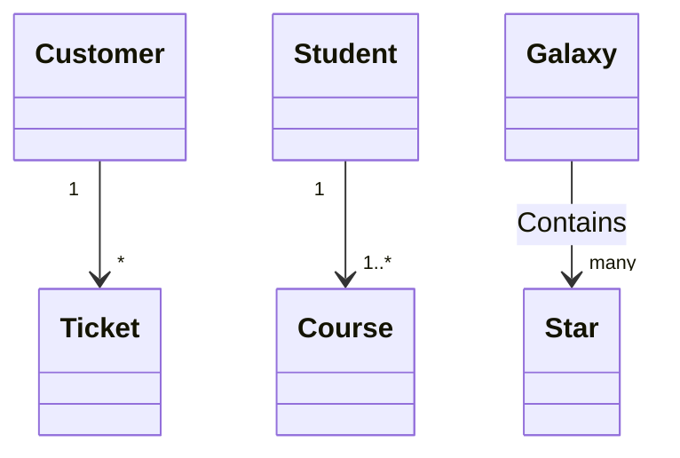
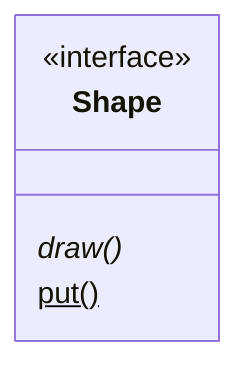

在markdown中绘制UML图

工具: Mermaid, Typora

[官网教程](https://mermaid-js.github.io/mermaid/#/)

Mermaid支持flowchart, sequence char, class diagram等

Typora已经集成了Mermaid直接插入代码块即可，其他markdown编辑器可能需要下载插件

## 基本语法

直接在typora中新建代码块，选择mermaid语言即可直接开始

```mermaid

```

### Flowchart

flowchar由节点，节点间连边和连边上的箭头组成

```mermaid
graph LR
	id(default) --> 
	id1[This is the text in the box] & b{"{test} #9829;"} ---
	id2([a]) -.->
	id3((a)) -- text-->
	id4[[a]] -. txt .->
	id5[(a)] == txt ==> id
```

- `graph LR`: `Left to Right`，类似的还有`TD/TB`(Top down/Top bottom)

- `id(context)`: `id`为节点唯一识别不能重复
- 括号内为显示内容，特数字符使用`""`
- 括号类型决定边框形状

- `-->`连线: 可以选择不同的连线类型，箭头类型或是添加文字

- 使用`&`组合节点来简单表达

**subgraph**

template

```markdown
subgraph title
	graph definition
end
```

example



**Style & Classes**



- `style id fill: xxxxxx`
- 使用`classDef className fill:xxxx`统一定义节点风格，调用时用`:::`连接在`id(context)`后

- `classDef default`将对所有节点应用

### Sequence Diagram

template

````markdown

````

也可以直接sequence代码快，画出来简陋一点

````markdown
```sequence
participant John
participant Alice
Alice->>John: Hello John, how are you?
John-->>Alice: Great!
```
````

```sequence
    Alice->>John: Hello John, how are you?
    John-->>Alice: Great!
    Note over John, Alice: TTTTT
```



- alias: `participant short-name as full-name`，注意简写和全称别反了
- 箭头：和[flowchar](#flowchart)中的箭头差不多
- 生命周期：使用`activate/deactivate`激活/关闭，或者`+/-`（仅限mermaid）

- Notes: `Note right of id: Text`，除了`right of`还有`over/left of`等

**Loop(仅mermaid)**

template

```markdown
loop Loop text
... statement ...
end
```

example



### Class Diagram



- 类定义和`java`基本一致，属性/方法可见性使用`+/-/#/~`表示
- 方法名后接`()`，返回值在方法名后
- 抽象方法/静态方法`abstractMethod()*/staticMethod()$`

- 属性和方法可以在类中定义也可以使用`Class: attr`添加

- 类间关系
  - `<|--`继承
  - `*--`组合
  - `o--`聚合
  - `-->`关联
  - `--`相关（实线）
  - `..>`依赖
  - `..|>`实现
  - `..`虚线



- 对应关系



- 类标签`<<interface>> Shape`



