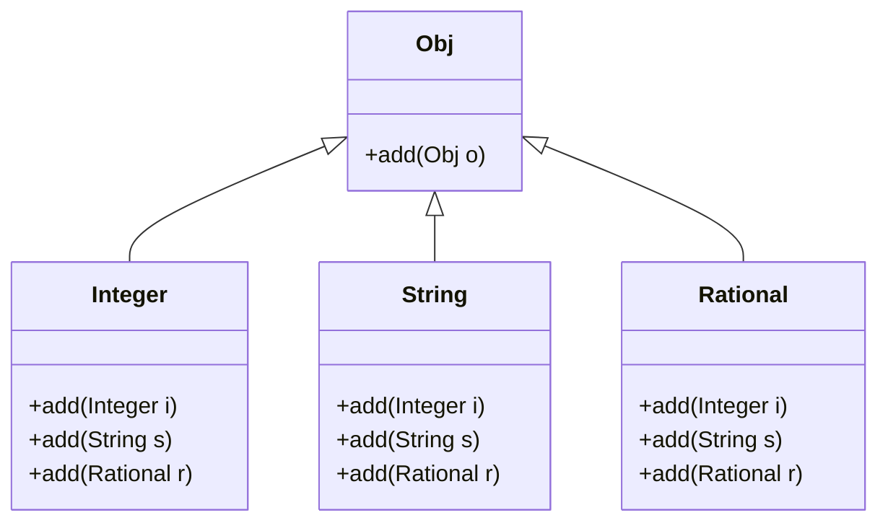
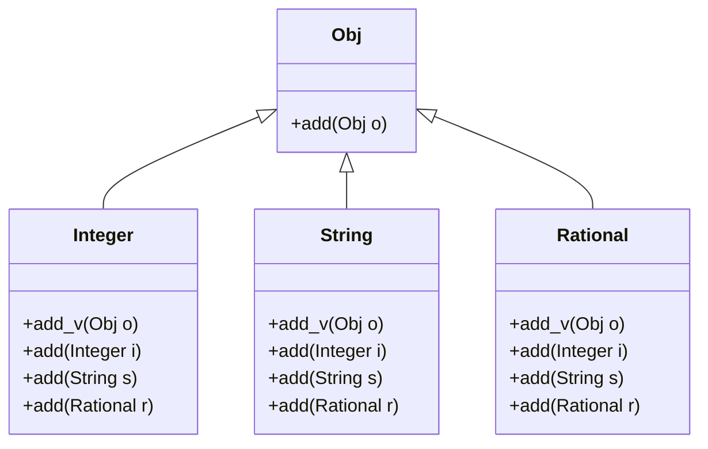

## 什么是动态分派(dynamic dispatch)?

[动态分派 - 维基百科，自由的百科全书 (wikipedia.org)](https://zh.wikipedia.org/wiki/动态分派)

> 在计算机科学中，动态分派（Dynamic dispatch）是指运行时选择哪一个多态的实现（具体的方法或函数）来调用的过程。
>
> 动态分派通常被应用于面向对象编程（OOP）的语言和系统，并被认为是一个主要特点。

[Method-Lookup Rules, Precisely | Coursera](https://www.coursera.org/learn/programming-languages-part-c/lecture/mx6uu/method-lookup-rules-precisely) 0:53

> Dynamic dispatch
>
> - Also known as *late binding* or *virtual methods*
> - Call `self.m2()` in method `m1` defined in class `C` can *resolve* to a method `m2` defined in a subclass of `C`
> - Most unique characteristic of OOP

**Example**

```java
class A {
	void m() { n(); //same as this.n();}
    void n() { System.out.println("method n() in A"); }
}

class B extends A {
    @Override
    void n() { System.out.println("method n() in B"); }
    
    public static void main(String[] args) {
        A a = new B();
        a.m(); //会输出 "method n() in B"
    }
}
```

- 定义一个父类`A`，其中`m`方法调用自身的`n`方法

- 定义一个子类`B`继承`A`，并覆盖`n`方法
- 新建一个`B`类的对象，调用其`m`方法
- `m`方法虽然原本是在类`A`中实现的，按照闭包和lexical scope的原则，其理应会调用类`A`中的`n`方法
- 然而由于**动态分派**的缘故，此时`m`会调用类`B`中覆盖后的`n`方法（而不是`A`中的`n`方法）

## 如何实现动态分派？

[Optional: Dynamic Dispatch Manually in Racket | Coursera](https://www.coursera.org/learn/programming-languages-part-c/lecture/FiXQW/optional-dynamic-dispatch-manually-in-racket)中介绍了一种实现方法：将`self`作为参数传给函数，所有方法都通过`self`调用。

> 1. 貌似很多语言都是通过这种方式实现的，比如python的class方法中就要显式的传入`self`作为参数
> 2. java中的`this`关键字，个人理解和`self`的作用一致，但是更加复杂
> 3. 由于`Racket`中括号太多，代码很难看，以下用python程序为例展开分析

下面分析一下python中如何实现动态分派的

使用python实现上述`A/B`例子

```python
class A:
    def m(self):
        self.n() # 直接 n()会报错
        self.k()
        
    def n(self):
        print("method n() in A")
        
class B(A):
    def n(self):
        print("method n() in B")
        
    def k(self):
        print("method k() in B")
        
b = B()
b.m() #等价于 B.m(b) <=> A.m(b)
'''
会输出
method n() in B
method k() in B
'''
```

- python要求程序显示的传入`self`作为参数，并通过`self`调用类中方法
  - 可以理解为显式动态分派？
- 个人理解：python类中的方法和普通方法**完全一样**，而类的作用**仅是将这些方法打包**
- `b.m()`其实是`B.m(b)`的语法糖
  - `B.m`其实就是一个普通的方法，其作用就是调用传入的对象的`n`和`k`方法
  - 由于`b`本身是通过`B()`创建的，创建时其`n`方法便是`B`中覆盖后的`n`方法
- **`B.m(b)`其实完全等价于`A.m(b)`**
  - 使用`A`中的代码，来处理`B`类型的对象

## 什么是多(双)分派？

[多分派 - 维基百科，自由的百科全书 (wikipedia.org)](https://zh.wikipedia.org/wiki/多分派)

> 多分派或译多重派发（multiple dispatch）或多方法（multimethod），是某些编程语言的一个特性，其中的函数或者方法，可以在运行时间（动态的）基于它的实际参数的类型，或在更一般的情况下于此之外的其他特性，来动态分派。
>
> 这是对单分派多态的推广， 那里的函数或方法调用，基于在其上调用方法的对象的派生类型，而动态分派。多分派使用一个或多个实际参数的组合特征，路由动态分派至实现函数或方法。

[Optional: Multimethods | Coursera](https://www.coursera.org/learn/programming-languages-part-c/lecture/g97lT/optional-multimethods)

> Multimethods
>
> - allow multiple methods with same name
> - indicate which ones take instances of which classes
> - **use dynamic dispatch on arguments in** addition to receiver to pick which method is called

**Example**

> 双分派支持的语言不多，个人也没用过支持双分派的语言，故拿个知道的语言举例子，假设其支持双分派，那么会有那些额外的功能。



假设Java支持双分派

```java
Obj i = new Integer();
Obj s = new String();
// 若java支持双分派，则以下代码就会自动调用Integer中对应的add(String s)方法
// 有点类似自动向下转型
// 但是java不支持双分派，故上述类的定义无法通过编译时的类型检查
i.add(s)
```

## Visitor模式

使用visitor模式，在单分派语言中手动实现双分派



```java
class Integer extends Obj {
    Obj add_v(Obj o) {
        o.add(this);
    }
}
```

使用上述代码，在调用`i.add_v(s)`时

1. 通过`i`将`add_v`分派为`Integer`中的`add_v`
2. 调用`o.add`，通过`o`将`add`分派为`String`中的`add`