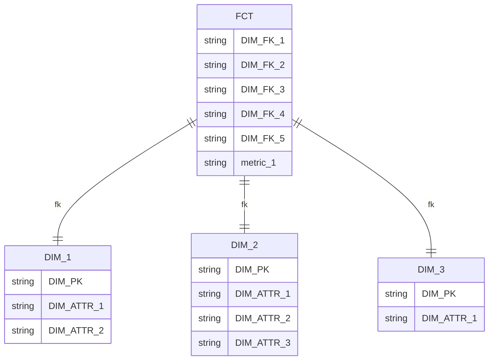
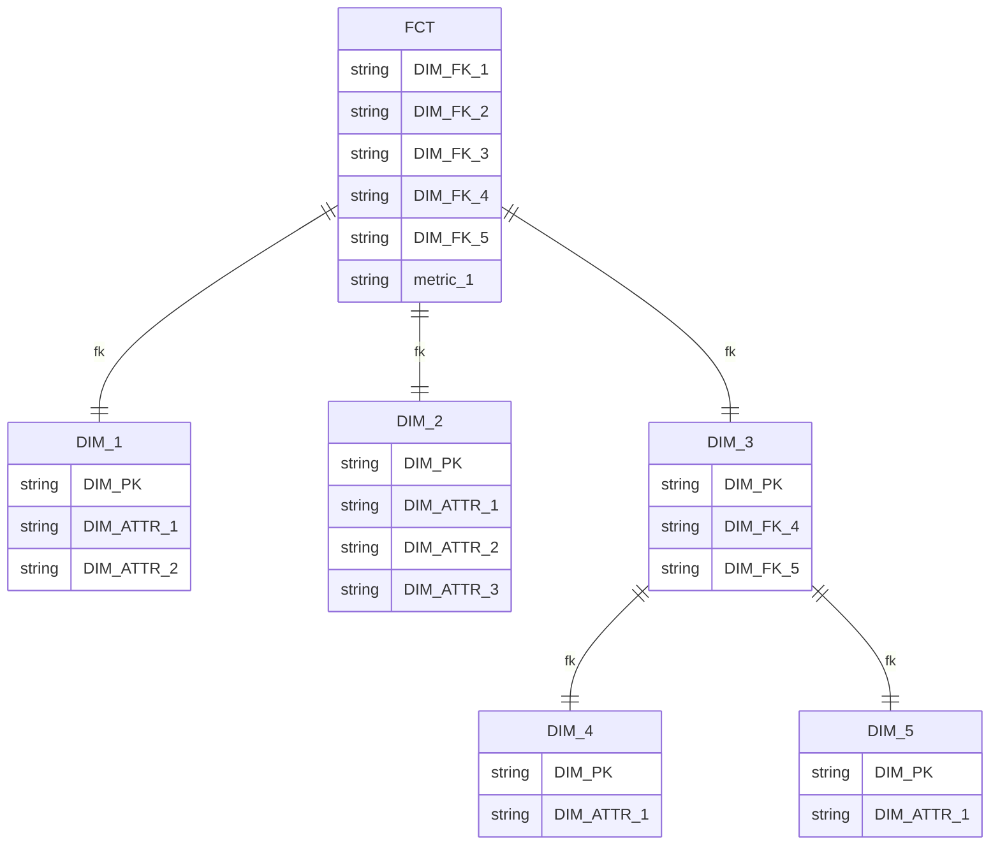
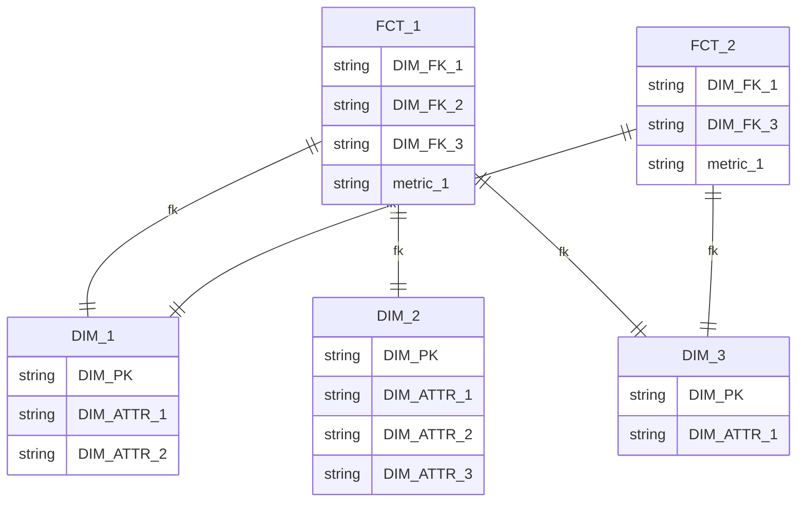

《数据架构之道：数据模型设计与管控》第7章维度建模

## 基本概念

> 维度模型由Ralph Kimball倡导，详见《数据仓库工具箱：维度建模权威指南》(The Data Warehouse Toolkit-The Complete Guide to Dimensional Modeling)

目标

- 以商业用户可理解的方式发布数据
- 提供高效的查询性能

### 事实表

> 维度外键+度量值

维度模型的基本表，存储部门业务过程事件的性能度量结果

- 多个部门相同业务过程的数据应该使用同一个维度模型集中存储与访问
- 事实代表一个业务**度量**结果
- 事实表中每一行代表一个**度量值**，每行数据是特定级别的细节数据，称为**粒度**

- 事实表中所有度量值必须有相同粒度
- **一个度量事件对应事实表中的一行**

### 维度表

> 维度主键+维度属性（描述）

组成事实表的一部分，维度表描述与业务过程度量事件的上下文

- 维度表一般倾向把行数设计的少但列数设计的多
  - 通常维度表包含50到100个属性

#### 退化维度

不单独做维度表，而是把维度属性放在事实表

## 常见模式

### 星型模式

维度建模有一个事实表和一组维度表组成，且

- 维度表只与事实表相连
- 维度主键为单独一列且放在事实表中作为外键
- 以事实表为核心，维度表围绕其呈星型分布

### 雪花模式

在星型模式上，维度表还可以与维度表相连（维度表间有嵌套层级关系）

- 不常用也不实用的维度模型

### 星座模式

星型模型+维度表共享

## 建模过程

维度建模过程需要懂业务需求的人参与设计（业务代表）

1. 选取业务过程
   - 应注重业务处理的过程，而不是业务的组织结构（部门，职能等）
2. 声明粒度
   - 优先考虑原子型模型--最低级别粒度
3. 确认维度
4. 确认事实
   - 一个事实表的行月按照事实描述的**度量事件**存在一对一关系

## 数仓总线

> 将不同业务处理过程产生的事实表通过公共的维度表集成
>
> - 如余额、交易和签约的事实表都包含客户维度，则可以通过客户维度将3者数据集成在一起方便分析与用户画像，同样的还有产品、账户维度等

数仓定义标准的总线接口

> *每个业务处理过程都创建一个维度模型，模型由事实表和多个关联维度组成，共享一组综合的具有一致性的共用维度*

### 一致性维度

> 即公共维度表

- 维度关键字
- 属性定义
- 属性列明
- 属性值

### 一致性事实

- 一致性事实表应该具有相同的业务意义，即定义、计算方式、度量单位等都应该相同
- *若事实或在业务要求上不能保持一致，那么建议不同的**度量单位**的事实数据分开建立字段进行保存*