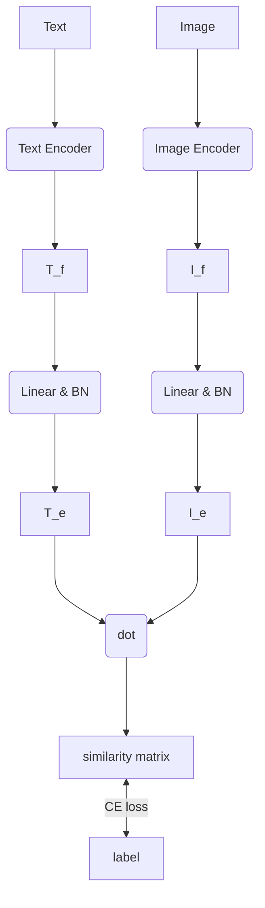

# CLIP

> *Contrastive Language–Image Pre-training* 2021/01/05
>
> [CLIP: Connecting text and images (openai.com)](https://openai.com/research/clip)

## Contrasive Pre-training

```python
# image_encoder - ResNet or Vision Transformer
# text_encoder - CBOW or Text Transformer
# I[n, h, w, c] - minibatch of aligned images
# T[n, l] - minibatch of aligned texts
# W_i[d_i, d_e] - learned proj of image to embed
# W_t[d_t, d_e] - learned proj of text to embed
# t - learned temperature parameter
# extract feature representations of each modality
I_f = image_encoder(I) #[n, d_i]
T_f = text_encoder(T) #[n, d_t]
# joint multimodal embedding [n, d_e]
I_e = l2_normalize(np.dot(I_f, W_i), axis=1)
T_e = l2_normalize(np.dot(T_f, W_t), axis=1)
# scaled pairwise cosine similarities [n, n]
logits = np.dot(I_e, T_e.T) * np.exp(t)
# symmetric loss function
labels = np.arange(n)
loss_i = cross_entropy_loss(logits, labels, axis=0)
loss_t = cross_entropy_loss(logits, labels, axis=1)
loss = (loss_i + loss_t)/2
```

1. 图片和文本都分别过自己的编码器，之后proj到相同长度的向量空间并做归一化(BN)
2. 图片和文本的embedding之间做dot得到相似度矩阵
   - 类似self-attention里的Q*K
3. 相似度矩阵和标签之间计算CE loss
   - 相似度矩阵维度为(n, n)
   - 标签为(n, n)的对角矩阵
   - 对第一维和第二维都做CE之后求平均为总loss
   - 两维分别表示图片对文本的attn和文本对图片的attn



