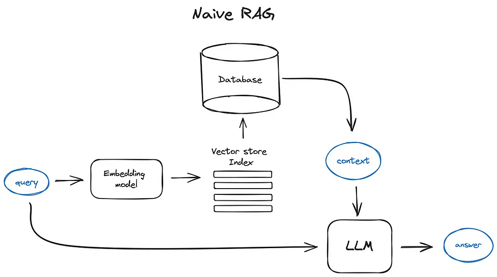
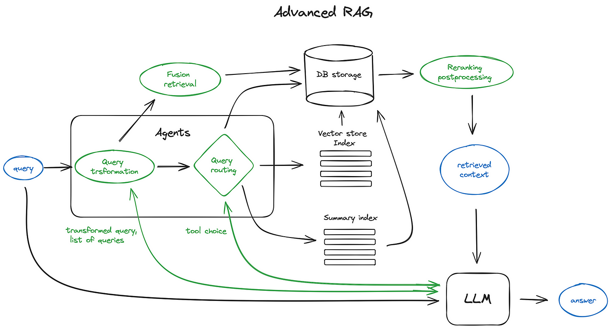
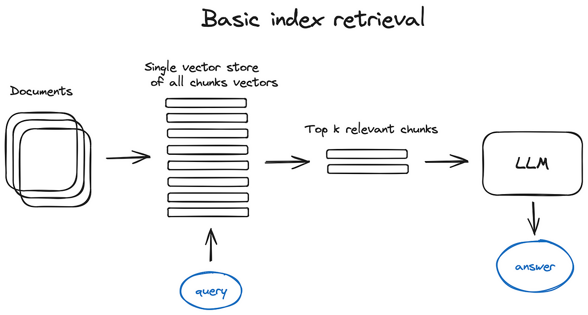
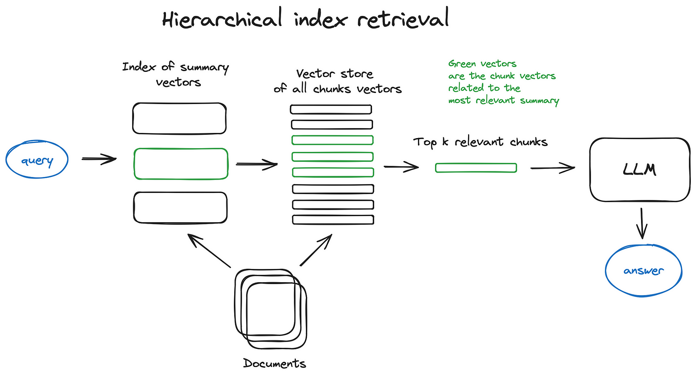

RAG全称Retrieval Augmented Generation，直译为检索增强生成，其基本思想是用户给定查询后，从现有数据集中检索出和查询相关的信息和查询本身一起输入给LLM，使得LLM生成的结果更加准确。

## 基础RAG



**流程**

1. 将查询通过嵌入模型转换为向量
2. 使用转换后向量去向量数据库中匹配，得到最相关的内容
3. 将内容和查询一同作为输入给LLM

**典型的LLM prompt**

```python
def question_answering(context, query):
    prompt = f"""
                Give the answer to the user query delimited by triple backticks ```{query}```\
                using the information given in context delimited by triple backticks ```{context}```.\
                If there is no relevant information in the provided context, try to answer yourself, 
                but tell user that you did not have any relevant context to base your answer on.
                Be concise and output the answer of size less than 80 tokens.
                """

    response = get_completion(instruction, prompt, model="gpt-3.5-turbo")
    answer = response.choices[0].message["content"]
    return answer
```

Prompt工程是一个成本最低但可以用于提升RAG pipeline的方法。

openai prompt guide: [prompt engineering guide](https://platform.openai.com/docs/guides/prompt-engineering/strategy-write-clear-instructions)

## 高级RAG



> 上图中的组件基本都是可选的而非必须的

### 切片和向量化

在RAG过程中，我们会创建资料的向量库索引以便在推理时找到最相关的向量资料。

1. 切片
   - 为什么要把资料切片再向量化？
     - transformer模型输入的序列数是有限的
     - 尽管模型输入序列可能很长，但是对一个或几个句子做向量化比对几页资料做向量化来说更能保留语义
   - 如何做切片？
     - 应该在不损失资料语义的情况下做切片，如按段落切分而不是把一句话砍成两半
     - 有很多现成的工具
   - 如何选择切片长度？
     - 根据嵌入模型的性能以及大模型的输入参数
     - 长度选择是一个tradeoff：长序列可以让llm有更充足的资料参考，而短序列可以让llm有更具体的资料参考
2. 向量化
   - 选择合适的嵌入模型，有转为搜索优化的模型如bge，E5等

### 索引

**向量库索引**



- 步骤
  1. 使用单个向量库存储所有切片的向量
  2. 在接受到查询将其向量化之后到库中比对
  3. 获取前k个相似度最高的切片

- 高效的向量库实现: faiss, nmslib等
- 集成方案：ES等

**层次化索引**



- 试用于资料库很大的情况

- 解决方法

  1. 创立两类索引

     - 内容总结的索引（大纲索引）

     - 切片索引（同上节，细节的索引）

  2. 两步式搜索：先通过大纲索引搜索定位，之后再定位切片索引