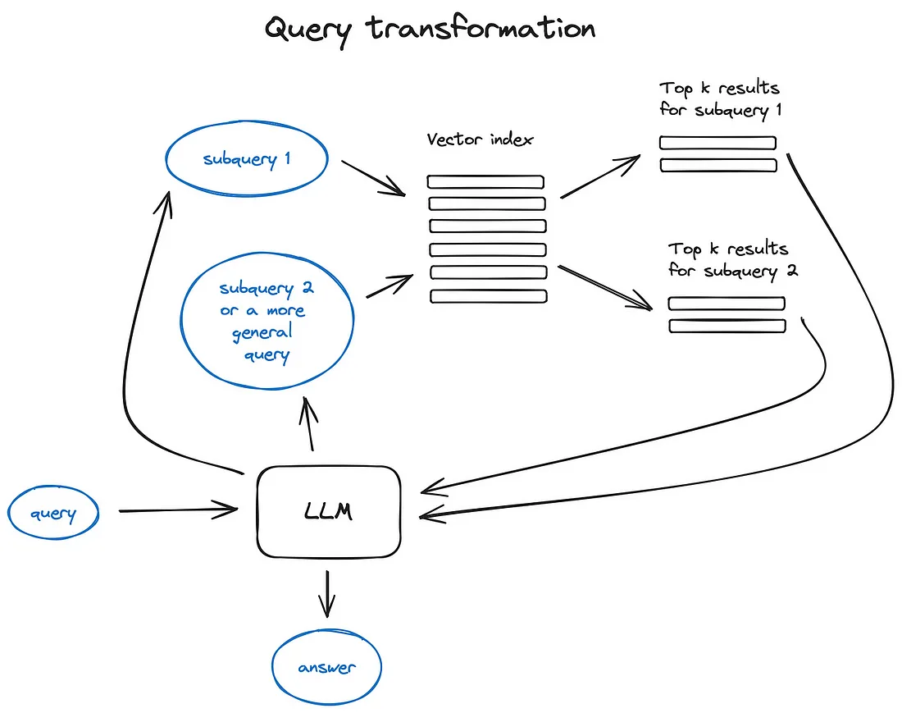
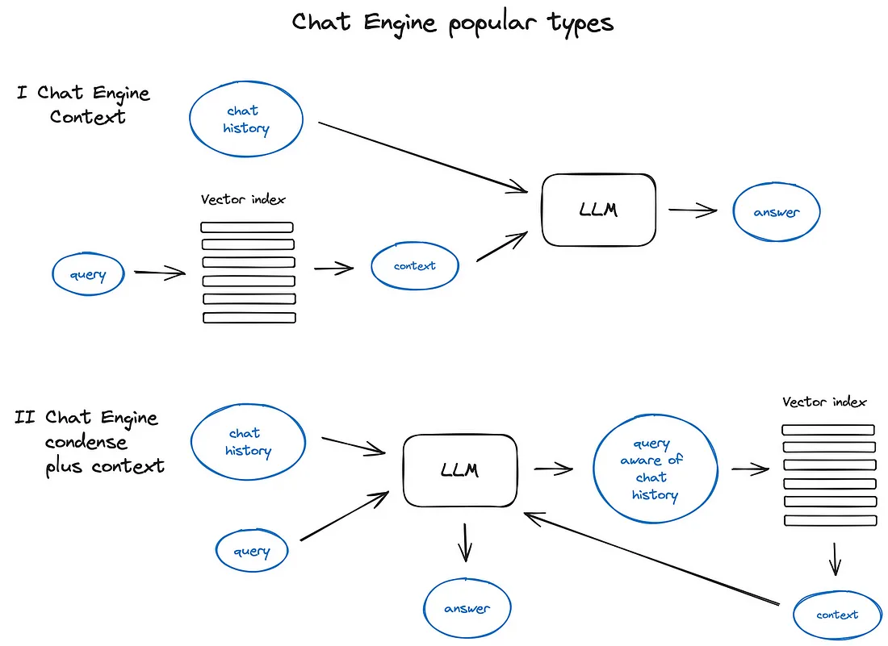
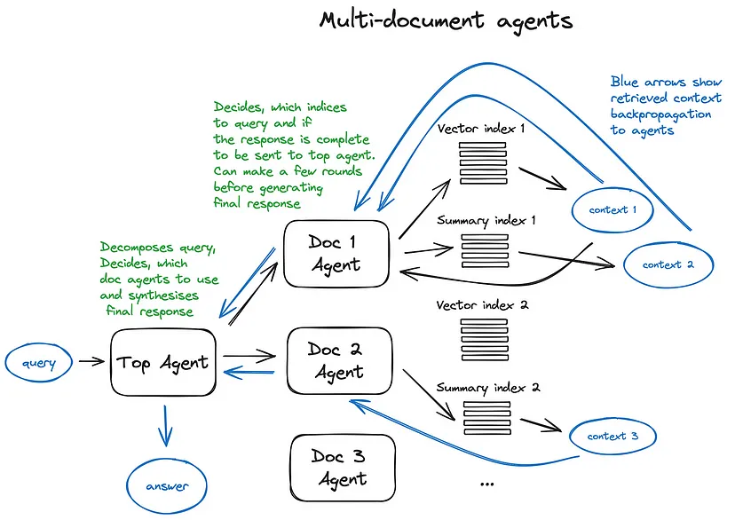

> 文挡来源：[Advanced RAG Techniques: an Illustrated Overview | by IVAN ILIN | Towards AI](https://pub.towardsai.net/advanced-rag-techniques-an-illustrated-overview-04d193d8fec6)

RAG全称Retrieval Augmented Generation，直译为检索增强生成，其基本思想是用户给定查询后，从现有数据集中检索出和查询相关的信息和查询本身一起输入给LLM，使得LLM生成的结果更加准确。

## 基础RAG


**流程**

1. 将查询通过嵌入模型转换为向量
2. 使用转换后向量去向量数据库中匹配，得到最相关的内容
3. 将内容和查询一同作为输入给LLM

**典型的LLM prompt**

```python
def question_answering(context, query):
    prompt = f"""
                Give the answer to the user query delimited by triple backticks ```{query}```\
                using the information given in context delimited by triple backticks ```{context}```.\
                If there is no relevant information in the provided context, try to answer yourself, 
                but tell user that you did not have any relevant context to base your answer on.
                Be concise and output the answer of size less than 80 tokens.
                """

    response = get_completion(instruction, prompt, model="gpt-3.5-turbo")
    answer = response.choices[0].message["content"]
    return answer
```

Prompt工程是一个成本最低但可以用于提升RAG pipeline的方法。

openai prompt guide: [prompt engineering guide](https://platform.openai.com/docs/guides/prompt-engineering/strategy-write-clear-instructions)

## 高级RAG


> 上图中的组件基本都是可选的而非必须的

### 切片和向量化

在RAG过程中，我们会创建资料的向量库索引以便在推理时找到最相关的向量资料。

1. 切片
   - 为什么要把资料切片再向量化？
     - transformer模型输入的序列数是有限的
     - 尽管模型输入序列可能很长，但是对一个或几个句子做向量化比对几页资料做向量化来说更能保留语义
   - 如何做切片？
     - 应该在不损失资料语义的情况下做切片，如按段落切分而不是把一句话砍成两半
     - 有很多现成的工具
   - 如何选择切片长度？
     - 根据嵌入模型的性能以及大模型的输入参数
     - 长度选择是一个tradeoff：长序列可以让llm有更充足的资料参考，而短序列可以让llm有更具体的资料参考
2. 向量化
   - 选择合适的嵌入模型，有转为搜索优化的模型如bge，E5等

### 索引

**向量库索引**


- 步骤
  1. 使用单个向量库存储所有切片的向量
  2. 在接受到查询将其向量化之后到库中比对
  3. 获取前k个相似度最高的切片

- 高效的向量库实现: faiss, nmslib等
- 集成方案：ES等

**层次化索引**


- 适用于资料库很大的情况

- 解决方法

  1. 创立两类索引

     - 内容总结的索引（大纲索引）

     - 切片索引（同上节，细节的索引）

  2. 两步式搜索：先通过大纲索引搜索定位，之后再定位切片索引

**通过大模型生成语料**

- 正向：
  1. 让大模型对每个切片都生成一个问题，将这些问题存入向量库
  2. 推理时通过用户查询找到最相似的问题，并将其对应的切片取出
- 反向 HyDE：
  1. ?

**上下文增强**

检索更小的切片，但是为其添加上下文信息

1. 句子窗口检索
   - 检索出最相关的切片后，将切片的上下文和切片一同输入到llm中
2. 自动合并检索
   - 将切片分段，若top-k中n个切片都属于同一分段则直接返回分段

### 重新排序和过滤

对检索得到的结果进行排序，通过相似度、关键字、元数据或者其他模型方式过滤。

### 查询转换



使用LLM作为推理引擎改变用户的输入来提升查询质量。

1. 后退提示：使用LLm生成更通用的查询形式
2. 使用LLm重新组织原始查询

### 引用参考

如果我们使用了多中来源的信息以生成回答，或者我们对于单个查询在不同文档中找到了相关上下文，此时我们希望能够通过答案准确的溯源到资源。

几种实现方式：

1. 在提示词中加入引用的任务
2. 将生成的回答每部分都匹配到原始文本的切片
   - fuzzy matching [incredibly powerful string matching technique](https://towardsdatascience.com/fuzzy-matching-at-scale-84f2bfd0c536)

### 对话引擎

好用的RAG系统应该不仅仅支持单次查询，同时还会考虑对话逻辑以及上下文



### 查询路由

给定查询由大模型来决定下一步动作

> 略

### RAG系统中的Agent

给予大模型调用工具的能力

**多文档Agent模式**



### 响应生成器

RAG pipeline中的最后一步：将通过用户查询在rag系统中得到的上下文信息输入大模型并得到回答。最原始的方法是将所有上下文信息和查询一起拼接输入给大模型。

其他主要方法

1. 通过把上下文按分片输入给LLM，迭代式地改进答案
2. 将上下文总结并纳入提示词模板中
3. 根据不同的上下文生成不同的答案，最后拼接或总结这些答案

## Encoder和LLM调优

如何对LLm和嵌入模型(encoder)，以及排名方法进行调优

### Encoder调优

作者对通过对嵌入模型进行调优而达到改进整个RAG系统效果的做法表示怀疑，因为目前对于搜索任务调优过的transformer嵌入模型已经相当强大。

此方法可能只在想要在一个小众领域数据集上构建RAG系统时有效。

### Ranker调优

通过分层的Encoder结构来确定排名最终排名。

> ?

### LLM调优

openai提供了LLM调优的api，来通过给定的RAG设置蒸馏gpt-4的知识。

[ragas](https://docs.ragas.io/en/latest/index.html)方法：

给定文档，让gpt-3.5生成一些问题，之后用gpt-4基于文档生成这些问题的答案（构建基于gpt-4的rag系统），之后使用这些QA对来对gpt-3.5调优。

## 评估

ragas

- 可信度
- 答案相关性

[Building and Evaluating Advanced RAG](https://learn.deeplearning.ai/building-evaluating-advanced-rag/) rag triad

- 检索的上下文相关性
- 材料的支撑度（LLM回答中多大比例的内容可以由检索到的材料支撑）
- 答案相关性

>  该篇文章的大多数章节都是为了RAG系统中检索的上下文的相关性。

现有工具

- langsmith

## 总结

目前生产上的RAG系统的主要挑战除了答案相关性和可信度以外还有推理速度。